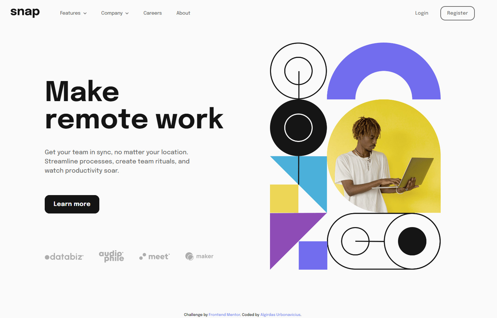

# Frontend Mentor - Intro section with dropdown navigation solution

This is a solution to the [Intro section with dropdown navigation challenge on Frontend Mentor](https://www.frontendmentor.io/challenges/intro-section-with-dropdown-navigation-ryaPetHE5). Frontend Mentor challenges help you improve your coding skills by building realistic projects. 

## Table of contents

- [Overview](#overview)
  - [The challenge](#the-challenge)
  - [Screenshot](#screenshot)
  - [Links](#links)
- [My process](#my-process)
  - [Built with](#built-with)
  - [What I learned](#what-i-learned)
- [Author](#author)
- [Acknowledgments](#acknowledgments)

## Overview

### The challenge

Users should be able to:

- View the relevant dropdown menus on desktop and mobile when interacting with the navigation links
- View the optimal layout for the content depending on their device's screen size
- See hover states for all interactive elements on the page

### Screenshot

### Links

- Solution URL: https://github.com/AlgirdasU/Intro-section-with-dropdown-navigation
- Live Site URL: https://superlative-cuchufli-f4535c.netlify.app

## My process

### Built with

- Semantic HTML5 markup
- CSS custom properties
- Flexbox
- CSS Grid
- SCSS
- JS

### What I learned
I decided grab this challenge that I can check my junior skills on HTML, CSS, SCSS, JS. I tried to use some different techniques, properties for example: template literals, conditional (ternary) operator instead if/else statement, toggle a little bit display flex/grid, how to use margin: auto on navigation manu.
This is my first code challang from Frontend Mentor.

## Author

- Website - [Algirdas Urbonavicius](https://superlative-cuchufli-f4535c.netlify.app)
- Frontend Mentor - [AlgirdasU](https://www.frontendmentor.io/profile/AlgirdasU)
- Twitter - [@AlgirdasDdd](https://twitter.com/algirdasddd)

## Acknowledgments
A big thanks to Jonas Schmedtmann and https://www.youtube.com/watch?v=S-VeYcOCFZw&ab_channel=WebDevSimplified

